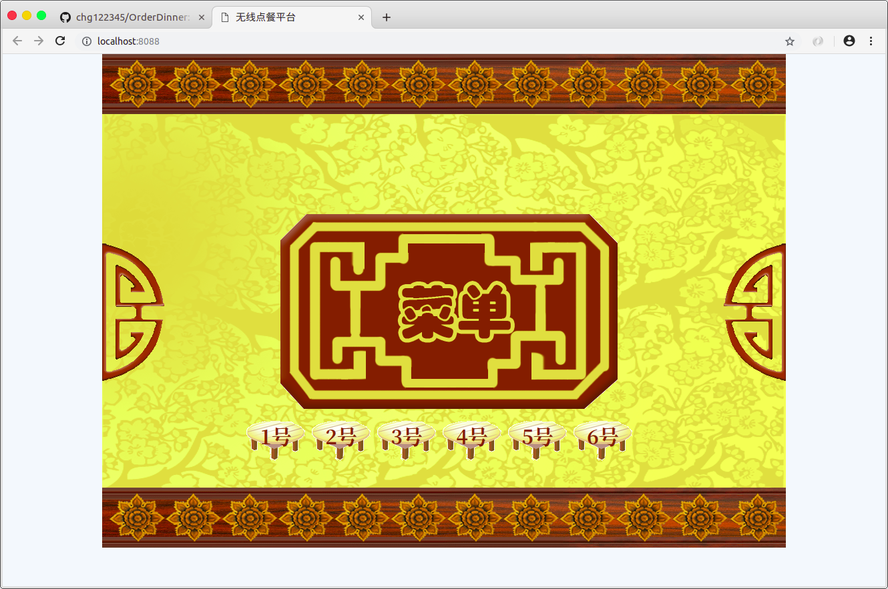
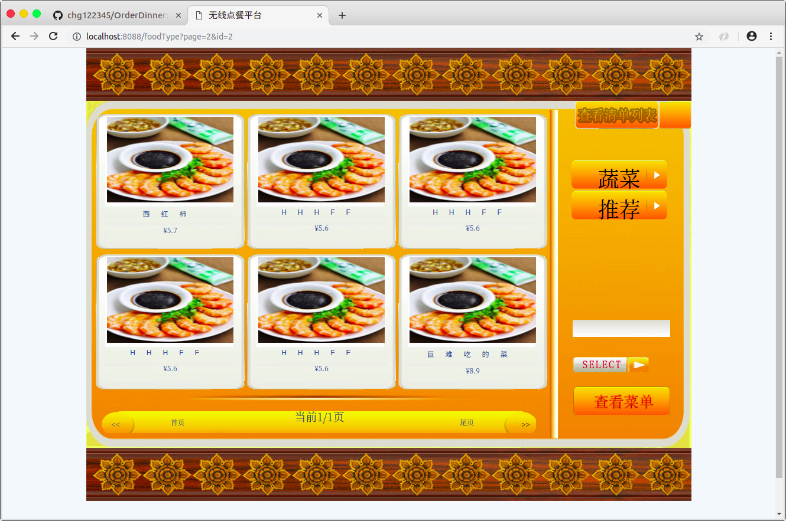
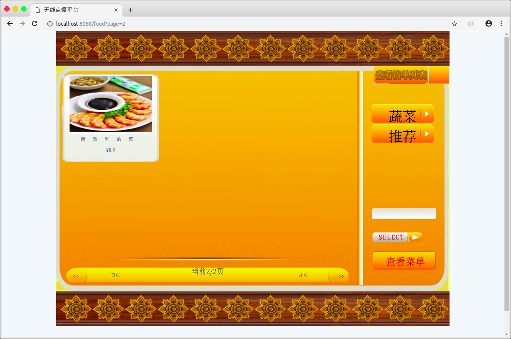
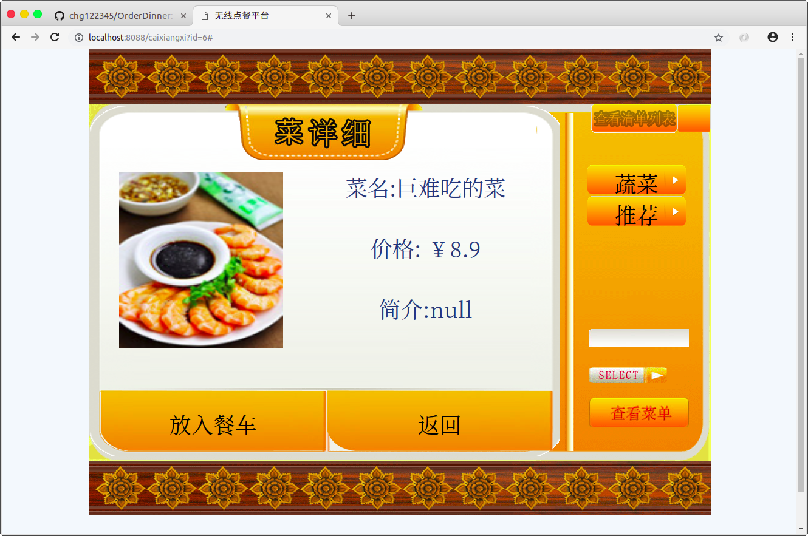
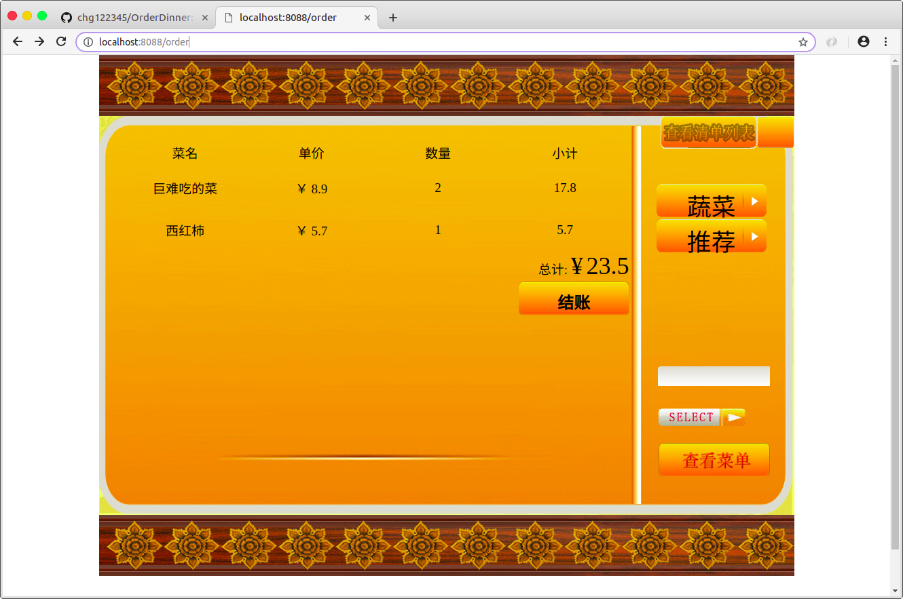

# jleopard-mvc
---
# Servlet极速开发脚手架

* 技术实现
    * [x] Jleopard-MVC 基于Servlet 3.1标准改造
        * 开始使用(在web.xml配置Servlet映射)
        ```xml
         <servlet>
            <servlet-name>dispatcherServlet</servlet-name>
            <servlet-class>org.jleopard.mvc.servlet.DispatcherServlet</servlet-class>
          </servlet>
          <servlet-mapping>
            <servlet-name>dispatcherServlet</servlet-name>
            <url-pattern>/</url-pattern>
          </servlet-mapping>
        ```
        * `Spring MVC`风格化
            1. 使用`@Controller`注解标记
            2. 请求映射方法自定义 `@RequestMapping(value = "",method = Method.POST)`(默认允许所有请求方法)
            3. 自动初始化方法内参数(复杂类型自动匹配字段名赋值)
            4. 支持返回json数据，只需标注`@RenderJson`注解即可
            ```java
           @Controller
           public class TableController {
           
               @Inject
               private DinnerTableService service;
           
               @RequestMapping("/table")
               @RenderJson
               public List<DinnerTable> list(String name){
                   return service.query();
               }
           
               @RequestMapping(value = "/table1",method = Method.POST)
               @RenderJson
               public DinnerTable table(DinnerTable t){
                   System.out.println("获取到的参数-->" + t);
                   return t;
               }
           }
             ```
        * 实现`IOC`，`DI`功能
            1. 在类上标注`@Bean`，`@Controller`注解就会扫描添加到bean容器内
            2. 运用时只需在字段上标注`@Inject`注解即可完成自动注入
            ```java
            @Bean
            public class OrderDetailService {
            
                @Inject
                private OrderDetialDao dao;
            
                public int add(OrderDetail od) {
                    return dao.insert(od);
            
                }
            
                public List<OrderDetail> query() {
                    return dao.select();
                }
            
                public List<OrderDetail> findByOrderid(Integer id) {
                    OrderDetail var1 = new OrderDetail();
                    var1.setId(id);
                    return dao.select(var1);
                }
            
            }
            ```
    * [x] [Jleopard](http:www.jleopard.org) ORM框架
        * 详细用法-->[传送门](https://www.github.com/chg122345/jleopard)
* 数据库
    * [x] MySQL数据库
* 项目结构
    ```
    -org.jleopard.ihotel
        -config  项目基础配置，数据库信息配置
        -controller Controller类
        -dao 数据持久层
        -entity 实体类
        -filter 过滤器
        -service 业务逻辑层
        -util 工具包
        -App 基础配置类
    ```
---
### 运行效果图
* [x] 首页



* [x] 点击小桌子进入菜单页




* [x] 右侧的搜索框(搜索菜名)


* [x] 点击图片进入详情页(选择加入餐车)



* [x] 点击右下角查看菜单可以看到已点的菜


* [x] 点击下单进入到订单页



* [x] 点击结账(流程结束)